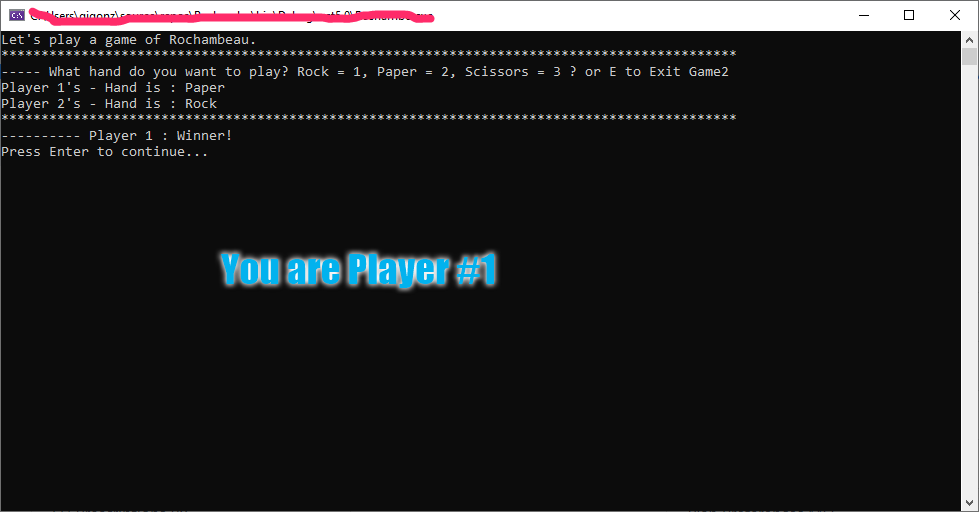

# Roshambo
## Roshambo_Csharp (Rochambeau)
Rock, Paper, Scissors or Rochambeau is a child’s game of chance using your hand to form a Rock, Paper or Scissors and when displayed to your opponent, a winner is declared. 
## Motivation
I was looking for a project that was hopefully quick and easy to get up and running with C#.
 ## Build status
It is completed and works, it is a console application so it is not that shiny.  
## Code style
C#
## Screenshots

## Tech/framework used
(IDE) Used for this project was 'Visual Studio 2019'.
## How to use?
1.	Open solution in Visual Studio 2019, or favorite IDE.
2.	Select run.  
## Credits
## License
I have placed this under the provisions and guidelines of a GNU License. 
GNU © [Gilbert Gonzales]()
